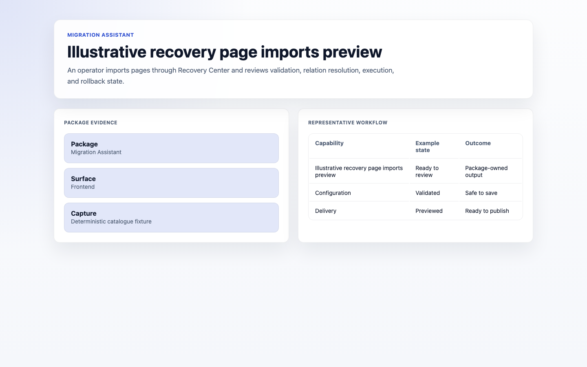
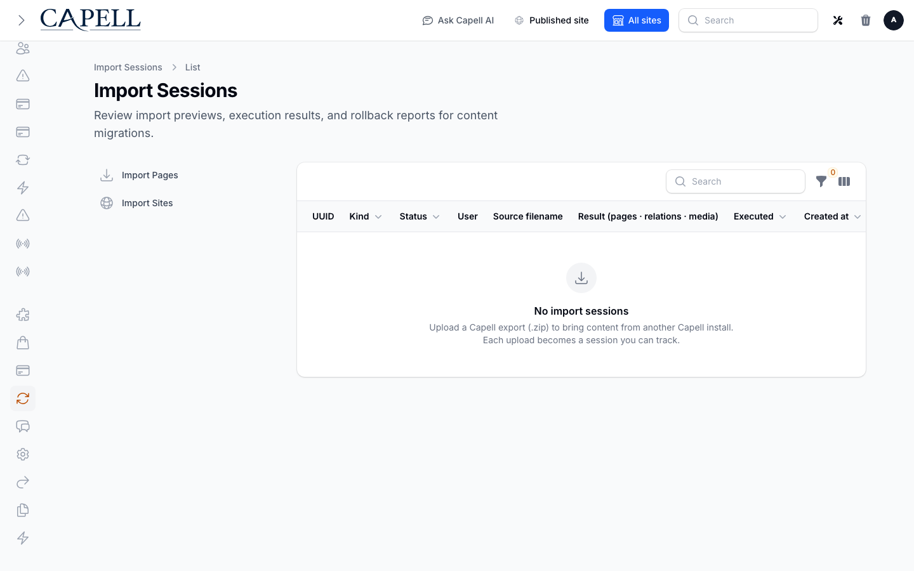

# Migration Assistant

<!-- prettier-ignore-start -->

## What This Plugin Adds

Migration Assistant is an **Available**, **Schema-owning** Capell package in the **Capell Operations** product group. It ships as `capell-app/migration-assistant` and extends these surfaces: admin, console.

Migration Assistant adds staged import sessions for mapping, validating, executing, reviewing, retrying, and rolling back external content imports.

Admins can upload or select source data, map it to Capell records, validate the plan, run the import, and inspect row-level results.

Evidence: [`src/Filament/Resources/ImportSessions/ImportSessionResource.php`](src/Filament/Resources/ImportSessions/ImportSessionResource.php), [`src/Actions/BuildImportValidationSummaryAction.php`](src/Actions/BuildImportValidationSummaryAction.php), [`src/Jobs/ExecuteImportPlanJob.php`](src/Jobs/ExecuteImportPlanJob.php), [`src/Actions/ExecuteImportRollbackAction.php`](src/Actions/ExecuteImportRollbackAction.php), [`src/Filament/Pages/ImportPagesPage.php`](src/Filament/Pages/ImportPagesPage.php), [`src/Filament/Pages/ImportSitesPage.php`](src/Filament/Pages/ImportSitesPage.php), [`tests/Admin/Feature/Filament/Pages/ImportPagesPageValidateTest.php`](tests/Admin/Feature/Filament/Pages/ImportPagesPageValidateTest.php), [`tests/Admin/Feature/Filament/Pages/ImportPagesPageExecuteTest.php`](tests/Admin/Feature/Filament/Pages/ImportPagesPageExecuteTest.php).

Status details:

- Status: Available
- Tier: premium
- Bundle: operations
- Composer package: `capell-app/migration-assistant`
- Namespace: `Capell\MigrationAssistant`
- Theme key: not applicable

## Why It Matters

**For developers:** Source, target, and executor registries keep import formats and destinations replaceable while Actions own validation, authorization, recovery, and rollback.

**For teams:** Teams can review migration problems before content is written and keep a recovery path when an import needs to be undone.

Evidence: [`src/Support/ImportSourceRegistry.php`](src/Support/ImportSourceRegistry.php), [`src/Support/ImportTargetRegistry.php`](src/Support/ImportTargetRegistry.php), [`src/Support/ImportSessionExecutorRegistry.php`](src/Support/ImportSessionExecutorRegistry.php), [`tests/Integration/MigrationAssistant/ExecuteImportRollbackActionTest.php`](tests/Integration/MigrationAssistant/ExecuteImportRollbackActionTest.php), [`docs/overview.admin.md`](docs/overview.admin.md), [`src/Actions/BuildImportRecoveryStatusAction.php`](src/Actions/BuildImportRecoveryStatusAction.php), [`src/Actions/CreateImportRollbackReportAction.php`](src/Actions/CreateImportRollbackReportAction.php).

## Screens And Workflow

Screenshot contract: `docs/screenshots.json`.

- Import session index or host admin surface (admin, supplementary evidence).
- Import validation summary (admin, supplementary evidence).
- Illustrative recovery page imports preview (frontend, required evidence).
- Relation resolution review (admin, supplementary evidence).
- Rollback report view (admin, supplementary evidence).
- Package export intent screen (admin, supplementary evidence).

## Technical Shape

- Service providers: `Capell\MigrationAssistant\Providers\MigrationAssistantInstallServiceProvider`, `Capell\MigrationAssistant\Providers\MigrationAssistantServiceProvider`.
- Config files: `packages/migration-assistant/config/migration-assistant.php`.
- Migrations: `packages/migration-assistant/database/migrations/2026_05_10_190859_01_create_import_sessions_table.php`, `packages/migration-assistant/database/migrations/2026_05_10_190859_02_create_import_rollback_reports_table.php`, `packages/migration-assistant/database/migrations/2026_06_04_000001_rename_import_rollback_reports_table.php`, `packages/migration-assistant/database/migrations/2026_07_10_000002_encrypt_import_diagnostics.php`, `packages/migration-assistant/database/migrations/2026_07_10_120000_harden_import_rollback_provenance.php`.
- Models: `ImportRollbackAudit`, `ImportRollbackReport`, `ImportSession`.
- Filament classes: `ImportPagesPage`, `ImportSitesPage`, `ImportSessionResource`, `ListImportSessions`, `ViewImportSession`, `ImportSessionInfolist`, `ImportSessionsTable`.
- Policies: `ImportSessionPolicy`.
- Extension contracts: `ImportSessionExecutor`, `ImportSessionSubNavigationExtender`, `ImportSourceReader`, `MigrationAssistantContextResolver`, `MigrationAssistantRowContributor`, `NullMigrationAssistantContextResolver`, `NullMigrationAssistantRowContributor`, `NullPageCollisionDetector`, `NullPageImportTargetResolver`, `PageCollisionDetector`, `PageImportTargetResolver`, `PathAwareImportSourceReader`.
- Events: `ImportCompleted`, `ImportCompleting`, `ImportFailed`.
- Listeners: `SendImportSessionNotifications`.
- Actions: `BuildImportRecoveryStatusAction`, `BuildImportValidationSummaryAction`, `BuildPageReviewRowsAction`, `BuildRelationResolveRowsAction`, `CancelImportSessionAction`, `ClaimImportSessionForExecutionAction`, `CreateImportRollbackReportAction`, `ExecuteImportRollbackAction`, `AdvancePageImportToValidationAction`, `AuthorizeExternalPageImportTargetAction`, `BindMigrationArchiveUploadAction`, `DispatchPageImportAction`, `and 11 more`.
- Data objects: `DependencyGraph`, `ExportOptions`, `ExternalImportPreview`, `ExternalImportReadResult`, `ExternalPageImportTargetData`, `ImportRecoveryStatusData`, `ImportValidationSummary`, `ExternalPageImportExecutionResult`, `PageImportDecisionData`, `PageImportStatusData`, `PageImportWizardStateData`, `PackageManifest`, `and 4 more`.
- Jobs: `ExecuteImportPlanJob`.
- Command signatures: `migration-assistant:export`, `migration-assistant:import`, `migration-assistant:rollback-execute`, `migration-assistant:rollback-report`, `migration-assistant:status`.
- Scheduled commands: `migration-assistant:reclaim-stale (everyTenMinutes; manifest declared)`.
- Console command classes: `ExecuteMigrationAssistantRollbackCommand`, `ExportMigrationAssistantPackageCommand`, `ImportMigrationAssistantPackageCommand`, `ReclaimStaleImportSessionsCommand`, `ShowMigrationAssistantRollbackReportCommand`, `ShowMigrationAssistantStatusCommand`.
- Manifest contributions: `admin-page: Capell\MigrationAssistant\Manifest\ImportPagesPageContribution`, `admin-page: Capell\MigrationAssistant\Manifest\ImportSitesPageContribution`, `admin-resource: Capell\MigrationAssistant\Manifest\ImportSessionResourceContribution`, `configurator: Capell\MigrationAssistant\Manifest\MigrationAssistantConsoleCommandsContribution`, `health-check: Capell\MigrationAssistant\Manifest\MigrationAssistantHealthContribution`, `model: Capell\MigrationAssistant\Manifest\MigrationAssistantModelsContribution`, `permission: Capell\MigrationAssistant\Manifest\MigrationAssistantPermissionsContribution`, `scheduled-job: Capell\MigrationAssistant\Manifest\MigrationAssistantRecoveryScheduleContribution`.
- Health checks: `Capell\MigrationAssistant\Health\MigrationAssistantHealthCheck`.

## Data Model

- Required tables: `import_sessions`, `import_rollback_reports`, `import_rollback_audits`.
- Models: `ImportRollbackAudit`, `ImportRollbackReport`, `ImportSession`.
- Core record references in migrations: `users via user_id`.
- Migration files: `2026_05_10_190859_01_create_import_sessions_table.php`, `2026_05_10_190859_02_create_import_rollback_reports_table.php`, `2026_06_04_000001_rename_import_rollback_reports_table.php`, `2026_07_10_000002_encrypt_import_diagnostics.php`, `2026_07_10_120000_harden_import_rollback_provenance.php`.
- Migration impact: run host migrations through the package install flow before opening package surfaces.
- Deletion/retention behaviour: migrations declare cascade-on-delete relationships and null-on-delete relationships; no timed pruning or retention schedule is declared in `capell.json`.

## Install Impact

- Required packages: `capell-app/admin`, `capell-app/core`.
- Admin navigation: declares `admin-page: ImportPagesPageContribution`, `admin-page: ImportSitesPageContribution`, `admin-resource: ImportSessionResourceContribution`; each Filament page or resource controls its own navigation visibility.
- Admin/editor extensions: `configurator: MigrationAssistantConsoleCommandsContribution`.
- Permissions: `page.export`, `page.import`, `page.import.update-shared-relations`, `page.import.publish-live`, `import-session.view`, `import-session.cancel`, `import-session.retry`, `import-session.rollback`.
- Public routes: none declared.
- Database changes: package migrations are declared.
- Config: `config/migration-assistant.php`.
- Settings: no package settings declared.
- Queues or schedules: scheduled commands `migration-assistant:reclaim-stale (everyTenMinutes; manifest declared)`; queue jobs `ExecuteImportPlanJob`.
- Cache tags: none declared.
- Commands: `migration-assistant:export`, `migration-assistant:import`, `migration-assistant:rollback-execute`, `migration-assistant:rollback-report`, `migration-assistant:status`.

## Common Pitfalls

- Keep required Capell packages on compatible v4 releases: `capell-app/admin`, `capell-app/core`.
- Run migrations before opening package resources or public routes.
- Review package configuration before production-like verification: `config/migration-assistant.php`.
- Keep the host Laravel scheduler running so package-registered schedules can execute: `migration-assistant:reclaim-stale (everyTenMinutes; manifest declared)`.

## Troubleshooting

| Symptom | Likely cause | Check | Fix |
| --- | --- | --- | --- |
| Package surface is missing after install | Provider or manifest is not loaded | Confirm `capell.json`, package `composer.json`, and provider registration | Reinstall the package, refresh Composer autoload, and clear host caches |
| Admin screen or command fails on missing table | Package migrations have not run | Check the tables listed in `Data Model` | Run host migrations and rerun the focused package test |
| Background work does not run | Queue worker or declared schedule is not active | Check the jobs and scheduled commands listed in `Technical Shape` | Start the queue worker or host scheduler, then run the focused command or package test |

## Quick Start

1. Install the package: `composer require capell-app/migration-assistant`.
2. Run the required setup: `php artisan migrate`.
3. Open `/screenshot-fixtures/catalogue/migration-assistant/recovery-page-imports` and confirm the public output renders without admin state.

## Next Steps

- [Package docs](docs/README.md)
- [Overview](docs/overview.md)
- [Admin guide](docs/admin-guide.md)
- Configuration files: [`config/migration-assistant.php`](config/migration-assistant.php).
- [Troubleshooting](#troubleshooting)
- [Screenshot contract](docs/screenshots.json)
- [Marketplace assets](docs/assets/marketplace/)
- [Capell content language plan](../../docs/CONTENT_LANGUAGE_PLAN.md)
- [Capell documentation design system](../../docs/DESIGN_SYSTEM.md)
- [Capell and package ERD notes](../../docs/erd/capell-and-package-erds.md)
- Related packages: [Media Library](../media-library/README.md), [Seo Suite](../seo-suite/README.md), [Site Discovery](../site-discovery/README.md), [Url Manager](../url-manager/README.md), [Wordpress Importer](../wordpress-importer/README.md).
- Focused tests: `vendor/bin/pest packages/migration-assistant/tests --configuration=phpunit.xml`.

<!-- prettier-ignore-end -->
