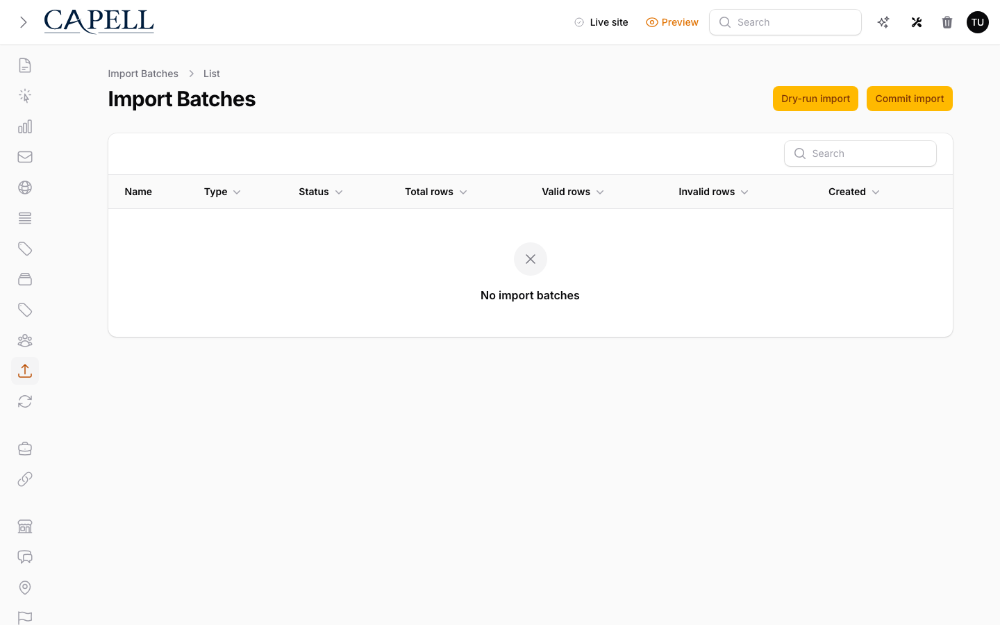

# Using Migration Assistant

This guide is for editors running a content import and owners planning a migration. Every step uses the labels you see on screen.

## Using Migration Assistant (editor how-to)

### How to start an import

1. Open **Recovery Center** and choose **Import pages** or **Import sites**.
2. Upload the Capell package archive (`.zip`), give the workspace a name, and optionally add a note.
3. Continue to create an import session you can return to from **Import sessions**.

### How to review imported pages

1. After the archive is read, review each proposed page action.
2. Keep the proposed action, skip an item, or record a note where the preview needs a decision.
3. Continue to relation resolution when the page review is complete.

### How to check validation before importing

1. Complete page review and relation resolution, then open the validation step.
2. Read the errors and warnings for the package and your decisions.
3. Fix the package or review decisions for anything marked as an error, then validate again.
4. Warnings are safe to proceed with, but worth reading first.

### How to match references to existing records

1. When your import links to other content (for example an author or a category), open the relation review step.
2. For each imported reference, choose the matching record that already exists in Capell.
3. Save your choices before you run the import, so links point to the right place.

### How to validate and run

1. Use the page review and validation steps to see what will be imported.
2. Check the validation summary carefully before dispatching.
3. Confirm the import when prompted, then let the queued job run.

### How to import pages through Recovery Center

1. Open **Recovery Center** and choose **Import pages**.
2. Upload a Capell page package, then work through page review, relation resolution, and validation.
3. Dispatch the import and watch its progress.
4. If something goes wrong, you can roll the import back from here.

### How to review the results

1. Open the finished import session.
2. Read the status and the list of anything that was skipped.
3. Fix and re-import any items that didn't come across.

### How to undo an import

1. Open the import you want to undo.
2. Roll it back to remove what it added.
3. Read the rollback report to see exactly what was changed and what manual cleanup, if any, is still needed.

### How to export content as a package

1. Choose to create an export package.
2. Confirm which resources are included before you download.
3. Download the package so you can move that content to another site.

## Rolling out Migration Assistant (for owners)

### Turn on first

- **A backup and a small test import.** Always back up first, then import a small batch to confirm the mapping before importing everything.

### Add when needed

| Need                               | Enable                                                   |
| ---------------------------------- | -------------------------------------------------------- |
| Import from a specific system      | The matching source (for example the WordPress Importer) |
| Repeat or resume a large migration | Multiple import sessions                                 |

### Don't enable yet

- Don't run a full import before previewing a sample. Map and preview first, then run.

### Who does what

| Role       | First useful screen                             |
| ---------- | ----------------------------------------------- |
| Editor     | Recovery Center: review, resolve, validate, and run |
| Site owner | **Import sessions**: track progress and results |

## Troubleshooting for editors

| What you see                           | What it means                               | What to do                                                                    |
| -------------------------------------- | ------------------------------------------- | ----------------------------------------------------------------------------- |
| Imported content is not what you expected | The page review or relation decisions were incorrect | Fix the package or decisions, then create a new import session              |
| Some items were skipped                   | The review or validation found a blocking issue          | Review the session result, fix the package or decisions, and import again   |
| The import session will not start          | The archive was missing, unreadable, or not a valid package | Upload a valid Capell ZIP package and check the validation message          |
| Images did not come across                 | The package did not contain usable media, or ingest rejected it | Check the rollback/result report and package media before trying again |
